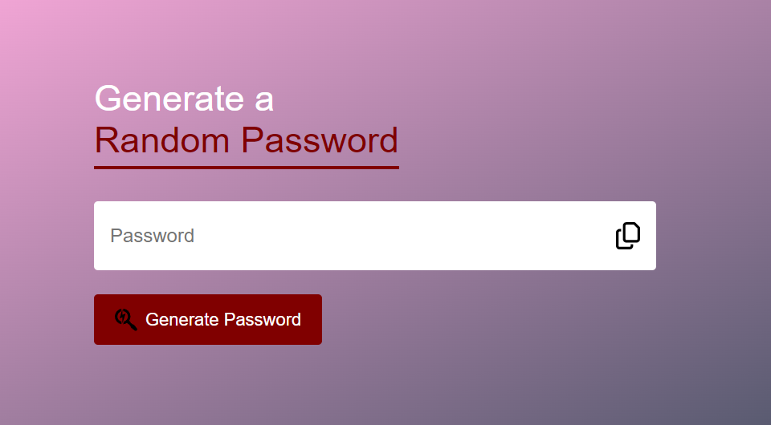
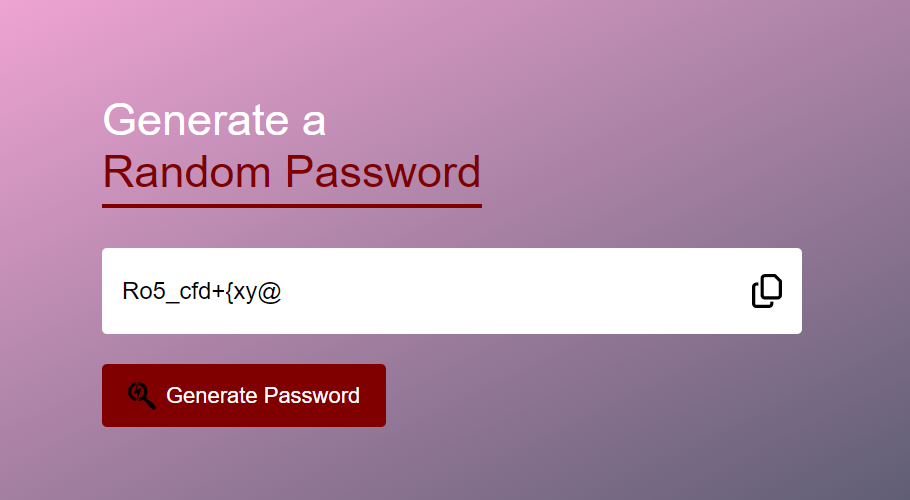

# RandomPasswordGenerator
## How does it work?
Random password generator using HTML CSS and JavaScript. This app will generate a password with Upper case, lower case, numbers and symbols. 

<a href="https://mamartam.github.io/RandomPasswordGenerator/">Random Password Generator</a>

